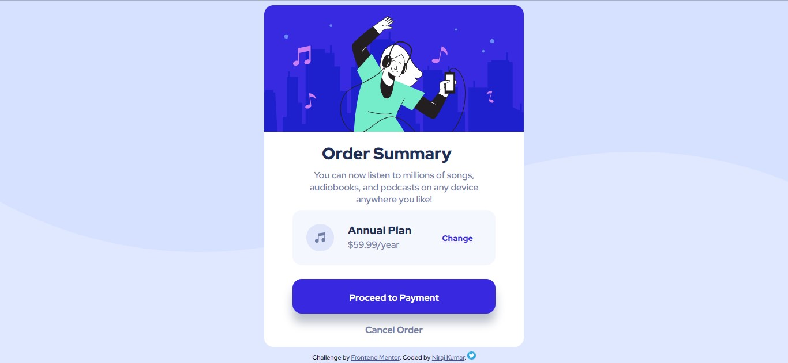
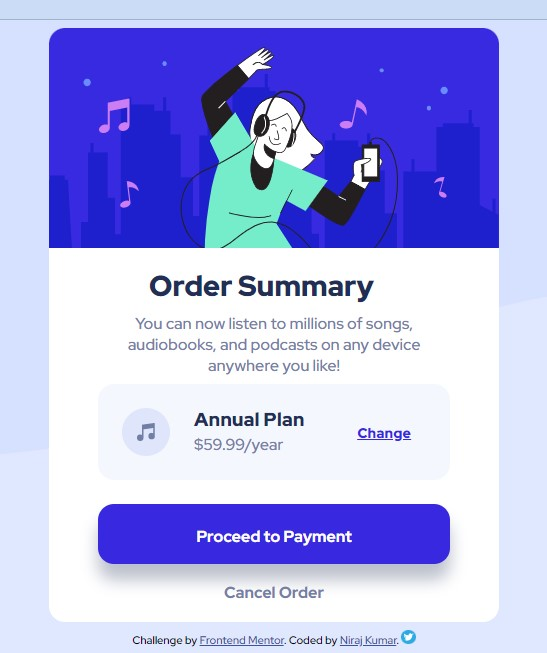

# Frontend Mentor - Order summary card solution

This is a solution to the [Order summary card challenge on Frontend Mentor](https://www.frontendmentor.io/challenges/order-summary-component-QlPmajDUj).

## Table of contents

- [Overview](#overview)
  - [The challenge](#the-challenge)
  - [Screenshot](#screenshot)
  - [Links](#links)
- [My process](#my-process)
  - [Built with](#built-with)
  - [What I learned](#what-i-learned)
  - [Continued development](#continued-development)
  - [Useful resources](#useful-resources)
- [Author](#author)

**Note: Delete this note and update the table of contents based on what sections you keep.**

## Overview

### The challenge

Users should be able to:

- See hover states for interactive elements

### Screenshot



### Links

<!-- - Solution URL: [Add solution URL here](https://your-solution-url.com)
- Live Site URL: [Add live site URL here](https://your-live-site-url.com)
will be added when it is available -->

## My process

### Built with

- Semantic HTML5 markup
- CSS custom properties

### What I learned

1) Got to know about resizing svg files by removing the height and width property inside the root file of svg, which then allows to set width and height in css.(if you do know a better way, feel free to DM me)

2) Clarified that var() is not used while declaring the variable in css, it is only used when calling
```css
:root{
    --primary-pale-blue: hsl(225, 100%, 94%);
}

.main-card{
    background-color: var(--primary-pale-blue);
}
```
3) Learnt about the proper syntax of box shadow

box-shadow: none|h-offset v-offset blur spread color |inset|initial|inherit;

4) Got practical experience about working with margins and padding

5) Will be learning markdown. If you want more help with writing markdown, we'd recommend checking out [The Markdown Guide](https://www.markdownguide.org/) to learn more.

### Continued development

This is not a responsive site as I haven't learnt it yet. This will be done in the future.

### Useful resources

- [css box shadow from w3 school](https://www.w3schools.com/cssref/css3_pr_box-shadow.asp) - This helped me.

## Author

- Frontend Mentor - [@niraj-kumar-r](https://www.frontendmentor.io/profile/niraj-kumar-r)
- Twitter - [@niraj_kumar_r](https://www.twitter.com/niraj_kumar_r)

<!-- - Website - [Niraj Kumar](https://www.your-site.com) 
will be added later when I actually learn enough to make one myself-->